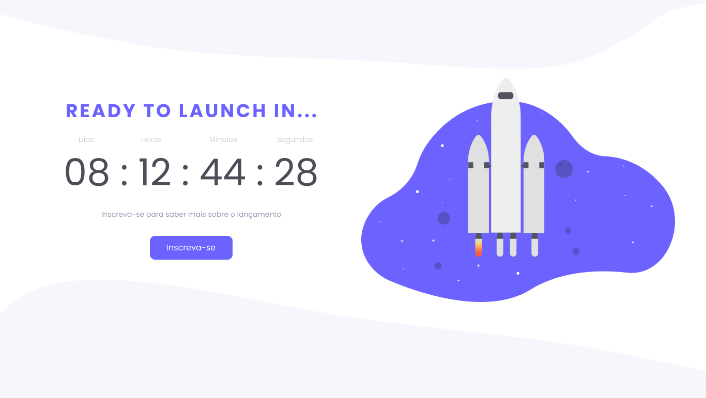

<h1 align="center"> Countdown </h1>

  <a href="#-tecnologias">Technologies</a>&nbsp;&nbsp;&nbsp;|&nbsp;&nbsp;&nbsp;
  <a href="#-projeto">Project</a>&nbsp;&nbsp;&nbsp;|&nbsp;&nbsp;&nbsp;
  <a href="#-layout">Layout</a>&nbsp;&nbsp;&nbsp;|&nbsp;&nbsp;&nbsp;
  <a href="#memo-licença">License</a>

  

 

  

## 🚀 Technologies

This project was made with the following technolgies:

- HTML e CSS
- JavaScript
- Git e Github

## 💻 Project

This countdown was a challenge proposed by Rocketseat.

## 🔖 Layout

You can see the prject layout throught the link: [THIS LINK](https://www.figma.com/file/dCYXbOvt97ZUh31WpywjrK/DD-%2F-Countdown-(Copy)?node-id=20%3A230&t=JOTswFd9XGUlNiFR-0). It's necessary to have a account on [Figma](https://figma.com) to access it

## :memo: License

This project is under the MIT license
